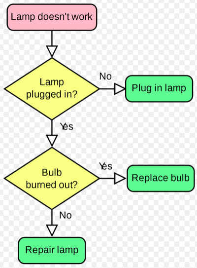
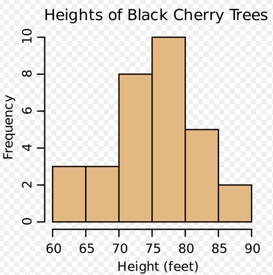

# Diagrams

- *Cause and effect diagram (fishbone)* - Identify root causes of the problem or defect. 

- *Flowcharts* - You can see the relationship between process steps.

- *Checksheets* - Organise a data around the problem. 

- *Pareto diagrams* - A vertical bar chart that creates a graphic display of events (such as causes of defects or types of defects) in descending order. The objective is to rank problems based on the frequency of occurrence to determine the order in which to resolve them.

- *Histograms*

- *Control charts* - Used to determine whether a process is stable and predictable.

- *Scatter diagrams* - An X,Y matrix that plots the relationship between two variables to determine whether a relationship exists.

- Afinity diagrams - sticky notes
